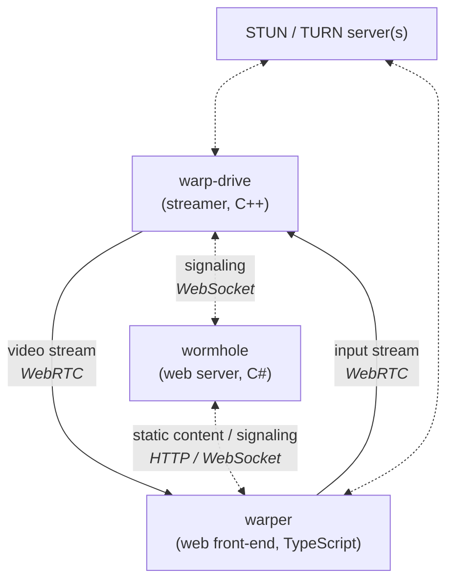

# Warper

Warper is a WebRTC based ultra-low latency video streaming prototype.

## Architecture

Warper uses the following architecture:

## Warp-drive

Warp drive is the video stream source, written in C++ (currently only targets Windows, but it could be updated for multi-platform operation). It supports multiple frame sources, such as screen / window capture. The provided frames are converted to a supported format then they are encoded on the GPU. The encoded video frames are sent to the web front-end using a WebRTC data channel.

The following libraries are used:

- [Frame capture](./warp-drive/Capture/WindowSource.cpp) is done by the [Graphics Capture API](https://learn.microsoft.com/en-us/uwp/api/windows.graphics.capture?view=winrt-26100)
- [Image preprocessing](./warp-drive/Encoder/VideoPreprocessor.cpp) (e.g. color space conversion, resolution scaling) is done using [Direct3D](https://learn.microsoft.com/en-us/windows/win32/api/d3d11/nn-d3d11-id3d11videodevice)
- [Video encoding](./warp-drive/Encoder/VideoEncoder.cpp) is done by the [NVEnc](https://docs.nvidia.com/video-technologies/video-codec-sdk/11.0/index.html)
- [Video streaming](./warp-drive/Messaging/WebRtcClient.cpp) is done using [libdatachannel](https://github.com/paullouisageneau/libdatachannel)

## Wormhole

Wormhole is an ASP.Net Core web-server, it connects [streaming sources](./wormhole/Sources/StreamingSourceController.cs) with [streaming sinks](./wormhole/Sinks/StreamingSinkController.cs). It also provides WebRTC signaling, which allows the stream source and sink to establish a peer-to peer-connection.

## Warper

Warper is a web front-end, which displays the decoded video, provides user inputs to the stream source. It uses the following technologies:

- Signaling uses [WebSockets](./warper/src/app/networking/web-socket-client.ts).
- Video is received using [WebRTC](./warper/src/app/services/streaming.service.ts)
- Video decoding uses [WebCodecs](./warper/src/app/components/stream-host/stream-host.component.ts)
- The UI is implemented using Angular and TypeScript.

## STUN / TURN servers

To establish a peer-to-peer connection between endpoints which might be behind [NAT](https://en.wikipedia.org/wiki/Network_address_translation), [STUN](https://en.wikipedia.org/wiki/STUN) / [TURN](https://en.wikipedia.org/wiki/Traversal_Using_Relays_around_NAT) servers are used to connect the endpoints, a process which is called [Interactive Connectivity Establishment](https://en.wikipedia.org/wiki/Interactive_Connectivity_Establishment). See [this article](https://medium.com/av-transcode/what-is-webrtc-and-how-to-setup-stun-turn-server-for-webrtc-communication-63314728b9d0) for a detailed explanation.